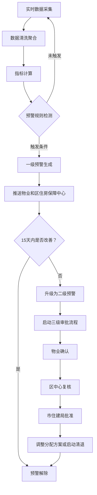

# 保障性住房分配与运营监测分析平台 PRD

## 1. 产品概述

全国性保障性住房分配与运营监测分析平台，实现公租房/保障性住房全生命周期数字化管理。通过实时数据接入、智能预警、预测分析等能力，为国家、省、市三级住房保障部门提供可视化决策支持，提升保障性住房分配效率与运营管理水平。

- 核心价值：解决保障性住房分配不透明、空置率高、租金收缴难、运营监管弱等痛点
- 目标用户：国家住建部、省住建厅、市住建局、区住房保障中心、物业管理部门

## 2. 核心功能

### 2.1 用户角色

| 角色 | 权限范围 | 核心能力 |
|------|----------|----------|
| 国家级用户 | 全国范围 | 查看全国统计报表、跨省份对比、全国预警总览 |
| 省级用户 | 本省范围 | 查看本省统计、省内城市排名、省级预警管理 |
| 市级用户 | 本市范围 | 查看本市详情、小区管理、市级预警审批 |
| 区级用户 | 本区范围 | 小区运营管理、预警确认、投诉处理 |
| 物业用户 | 所属小区 | 日常运营数据上报、租金管理、投诉响应 |

### 2.2 功能模块

1. **核心看板**：全国热力图、KPI指标卡、空置率排名、分配效率排名
2. **小区详情**：入住趋势、投诉分布、房源明细、租金收缴情况
3. **预警管理**：一级/二级预警列表、三级审批流程、预警处理记录
4. **年度计划**：Excel上传解析、分配缺口预测、分房批次推荐
5. **运营报告**：周度健康报告、同比环比分析、优化策略推荐
6. **数据管理**：申请人轮候、房源分配、租金缴纳、住户投诉数据

### 2.3 页面详情

| 页面名称 | 模块名称 | 功能描述 |
|---------|----------|----------|
| 核心看板 | 顶部导航 | 省份/城市切换、用户信息、三级权限标识 |
| 核心看板 | KPI指标卡 | 分配效率、空置率、租金收缴率、满意度四大核心指标 |
| 核心看板 | 全国热力图 | 按省份展示分配数量/空置率热力分布，支持下钻到城市 |
| 核心看板 | 排名列表 | 空置率TOP10城市、租金收缴率TOP10城市、分配效率排名 |
| 核心看板 | 预警概览 | 当前一级/二级预警数量、预警类型分布 |
| 小区详情 | 小区信息卡 | 小区名称、位置、总户数、户型分布 |
| 小区详情 | 入住趋势 | 近7天/30天入住率曲线图 |
| 小区详情 | 投诉分布 | 饼图展示投诉类型占比、投诉趋势 |
| 小区详情 | 租金收缴 | 收缴率趋势、欠费明细 |
| 预警管理 | 预警列表 | 按级别、状态筛选的预警卡片列表 |
| 预警管理 | 审批流程 | 三级审批流转（物业确认→区中心复核→市住建局批准） |
| 预警管理 | 预警详情 | 触发条件、历史数据、处理建议 |
| 年度计划 | 文件上传 | Excel模板下载、批量上传、数据校验 |
| 年度计划 | 缺口预测 | 未来90天分配缺口预测曲线 |
| 年度计划 | 批次推荐 | 最优分房批次方案、房源投放节点建议 |
| 运营报告 | 周度报告 | 空置率同比环比、轮候平均时长、租金收缴趋势 |
| 运营报告 | 优化建议 | 分配策略优化、清退方案推荐 |
| 数据管理 | 数据接入 | 四类数据实时接入状态、数据清洗日志 |
| 数据管理 | 数据查询 | 按维度筛选查询明细数据 |

## 3. 核心流程

### 3.1 预警触发与处理流程

实时数据采集 → 数据清洗聚合 → 指标计算 → 预警规则检测 → 一级预警生成 → 推送物业/区中心 → 15天未改善 → 升级二级预警 → 启动三级审批 → 调整分配方案/启动清退 → 预警解除

### 3.2 年度计划预测流程

上传Excel计划 → 系统解析房源投放节点 → 联合轮候数据分析 → 未来90天分配缺口预测 → 生成最优分房批次推荐 → 人工确认执行

## 4. 用户界面设计

### 4.1 设计风格

- **设计理念**：政务级数据可视化平台，专业严谨、数据驱动、决策导向
- **主色调**：深蓝 #0B3D91（政务权威感）+ 亮蓝 #1E88E5（科技感）
- **辅助色**：警示红 #E53935、成功绿 #43A047、警告橙 #FB8C00、信息青 #00ACC1
- **背景**：深灰蓝渐变 #0F172A 至 #1E293B（暗色数据大屏风格）
- **卡片**：半透明玻璃拟态效果，边框微亮
- **字体**：标题使用思源黑体 Bold，正文使用思源黑体 Regular
- **布局**：卡片式栅格布局，数据大屏风格，顶部全局导航 + 左侧功能菜单
- **动效**：数据加载数字滚动动画、卡片悬浮微亮效果、图表渐入动画

### 4.2 页面设计概览

| 页面名称 | 模块名称 | UI元素 |
|---------|----------|--------|
| 核心看板 | KPI指标卡 | 大数字+趋势箭头+同比环比标签，渐变背景光晕 |
| 核心看板 | 热力图 | 中国地图省份区块着色，悬浮显示详情，渐变色阶 |
| 核心看板 | 排名列表 | 带序号的横向进度条，颜色区分好坏 |
| 核心看板 | 预警概览 | 红色警示卡片，闪烁动画效果 |
| 小区详情 | 趋势曲线 | 平滑折线图，渐变填充区域 |
| 小区详情 | 投诉分布 | 环形饼图，中心显示总数 |
| 预警管理 | 预警卡片 | 红色/橙色边框区分级别，状态标签，进度指示 |
| 年度计划 | 上传区域 | 拖拽上传区域，文件列表，解析进度 |
| 运营报告 | 报告卡片 | 杂志式排版，数据突出，建议区块 |

### 4.3 响应式

- 桌面端优先设计，适配 1920×1080 及以上分辨率
- 支持平板横屏浏览，图表自适应缩放
- 左侧菜单在小屏幕可收起为图标模式

### 4.4 数据可视化

- 使用 ECharts 作为图表库
- 地图采用中国地图GeoJSON
- 图表配色统一使用设计系统色板
- 支持图表数据下钻交互

---

*文档版本：v1.0*
*创建日期：2026-06-14*
