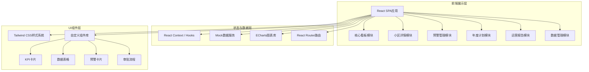

# 保障性住房运营监测平台 - 技术架构文档

## 1. 架构设计



## 2. 技术选型说明

### 2.1 前端技术栈

| 技术 | 版本 | 用途 |
|------|------|------|
| React | 18.x | UI构建框架 |
| React Router | 6.x | 前端路由管理 |
| TypeScript | 5.x | 类型安全 |
| Vite | 5.x | 构建工具 |
| Tailwind CSS | 3.x | 原子化CSS框架 |
| ECharts | 5.x | 数据可视化图表 |
| echarts-for-react | 3.x | React ECharts封装 |

### 2.2 项目初始化

- 脚手架：Vite + React + TypeScript
- 包管理工具：npm
- 代码规范：ESLint + Prettier

### 2.3 数据策略

由于本项目为前端演示版本，采用以下数据策略：
- 全部使用 Mock 数据模拟后端接口
- 数据按省份、城市、小区三级结构组织
- 使用随机数生成器模拟实时数据变化
- 内置多个典型小区的完整数据样本

## 3. 路由定义

| 路由路径 | 页面名称 | 权限级别 | 说明 |
|---------|----------|----------|------|
| /dashboard | 核心看板 | 所有级别 | 首页，展示全国/全省/全市概览 |
| /community/:id | 小区详情 | 市级及以下 | 小区下钻详情页 |
| /warnings | 预警管理 | 市级及以下 | 预警列表与审批管理 |
| /warnings/:id | 预警详情 | 市级及以下 | 单个预警详情与处理 |
| /plan | 年度计划 | 市级及以上 | 分配计划上传与预测 |
| /reports | 运营报告 | 省级及以上 | 周度/月度运营报告 |
| /data | 数据管理 | 所有级别 | 数据接入状态与查询 |

## 4. 目录结构

```
src/
├── assets/              # 静态资源
│   ├── fonts/           # 字体文件
│   └── map/             # 地图GeoJSON
├── components/          # 公共组件
│   ├── layout/          # 布局组件
│   │   ├── Header.tsx   # 顶部导航
│   │   ├── Sidebar.tsx  # 左侧菜单
│   │   └── index.tsx    # 主布局
│   ├── charts/          # 图表组件
│   │   ├── ChinaMap.tsx # 中国热力图
│   │   ├── LineChart.tsx# 折线图
│   │   └── PieChart.tsx # 饼图
│   ├── KpiCard.tsx      # KPI卡片
│   ├── WarningCard.tsx  # 预警卡片
│   └── DataTable.tsx    # 数据表格
├── pages/               # 页面组件
│   ├── Dashboard/       # 核心看板
│   ├── Community/       # 小区详情
│   ├── Warnings/        # 预警管理
│   ├── Plan/            # 年度计划
│   ├── Reports/         # 运营报告
│   └── Data/            # 数据管理
├── data/                # Mock数据
│   ├── index.ts         # 数据聚合出口
│   ├── regions.ts       # 省市区数据
│   ├── communities.ts   # 小区数据
│   ├── warnings.ts      # 预警数据
│   └── reports.ts       # 报告数据
├── hooks/               # 自定义Hooks
│   ├── usePermission.ts # 权限控制
│   └── useRegion.ts     # 区域切换
├── context/             # React Context
│   ├── AuthContext.tsx  # 用户认证
│   └── RegionContext.tsx# 区域上下文
├── types/               # TypeScript类型
│   └── index.ts         # 类型定义
├── utils/               # 工具函数
│   ├── format.ts        # 格式化工具
│   └── mock.ts          # Mock数据生成
├── App.tsx              # 根组件
├── main.tsx             # 入口文件
└── index.css            # 全局样式
```

## 5. 数据模型

### 5.1 核心数据实体

```mermaid
erDiagram
    PROVINCE ||--o{ CITY : has
    CITY ||--o{ COMMUNITY : has
    COMMUNITY ||--o{ BUILDING : has
    COMMUNITY ||--o{ COMPLAINT : has
    COMMUNITY ||--o{ RENT_RECORD : has
    COMMUNITY ||--o{ WARNING : has
    APPLICANT ||--o{ WAIT_RECORD : has
    WAIT_RECORD ||--o| ALLOCATION : assigned

    PROVINCE {
        string id PK
        string name
        number communityCount
        number totalUnits
    }

    CITY {
        string id PK
        string provinceId FK
        string name
        number vacancyRate
        number rentCollectionRate
    }

    COMMUNITY {
        string id PK
        string cityId FK
        string name
        string address
        number totalUnits
        number occupiedUnits
        number unitTypes JSON
        number satisfaction
    }

    WARNING {
        string id PK
        string communityId FK
        string level
        string type
        string status
        date triggerDate
        number currentValue
        number threshold
    }

    COMPLAINT {
        string id PK
        string communityId FK
        string type
        string status
        date createDate
    }

    RENT_RECORD {
        string id PK
        string communityId FK
        number month
        number shouldCollect
        number actualCollect
        number rate
    }
```

### 5.2 KPI指标定义

| 指标名称 | 计算公式 | 数据来源 |
|---------|----------|----------|
| 分配效率 | 已分配房源 / 轮候申请人数 × 100% | 申请人轮候表 + 房源分配表 |
| 空置率 | 空置房源数 / 总房源数 × 100% | 房源表 |
| 租金收缴率 | 实收租金 / 应收租金 × 100% | 租金缴纳表 |
| 满意度 | 有效好评数 / 有效评价总数 × 100% | 住户投诉表 + 评价表 |

### 5.3 预警规则

| 预警级别 | 触发条件 | 推送对象 | 处理时限 |
|---------|----------|----------|----------|
| 一级预警 | 连续30天空置率 > 10% 或 租金收缴率 < 80% | 物业、区住房保障中心 | 15天 |
| 二级预警 | 一级预警15天内未改善 | 区中心、市住建局 | 启动三级审批 |

## 6. 核心模块设计

### 6.1 权限控制系统

- 使用 React Context 管理当前用户角色
- 根据角色过滤可见数据范围（国家/省/市）
- 路由级权限守卫，无权限跳转403
- 组件级权限控制，隐藏不可用功能

### 6.2 区域切换系统

- 三级区域联动：国家 → 省 → 市
- 使用 Context 管理当前选中区域
- 所有数据自动按当前区域过滤
- 支持快速切换和面包屑导航

### 6.3 数据可视化

- 统一封装 ECharts 图表组件
- 图表主题与整体UI风格一致
- 支持图表数据下钻交互
- 响应式自适应容器大小

---

*文档版本：v1.0*
*创建日期：2026-06-14*
